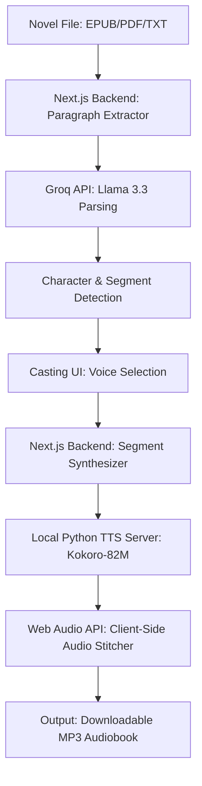

# NovelCast 🎧✨

Turn any novel into a living, multi-voice audiobook! Upload your `.txt`, `.pdf`, or `.epub` files, auto-detect characters and emotions using high-performance AI, assign custom voices, and synthesize a fully stitched production-ready audiobook—all powered by a local, ultra-fast TTS engine.

---

## 🚀 The Magic of NovelCast

Ever wanted to listen to your favorite book with a full cast of characters, dramatic narration, and expressive emotional tones? 

NovelCast does exactly that:
* **Deep Literary Parsing**: Uses **Groq** (powered by Meta Llama 3.3) to split your book into narrator blocks and character dialogue, tag who is speaking, and identify the emotional tone (neutral, calm, angry, sad, joyful, fearful, tense).
* **Local Synthesis (Zero Costs)**: Synthesizes high-fidelity speech locally using the **Kokoro-82M** TTS model, bypassing expensive voice API fees.
* **Voice Casting Studio**: Assign specific voices (US or UK, male or female) to your characters, or let the AI automatically suggest the perfect voice match based on character descriptions.
* **Seamless Audio Stitching**: Automatically merges all synthesized dialogue and narration segments, inserting natural pauses between paragraphs, and packages the result into a clean, downloadable MP3.

---

## 🛠️ Architecture



---

## ⚙️ Quickstart Guide

### 1. Setup the Local TTS Engine (Python)

The local voice synthesizer is built on FastAPI and uses the Kokoro-82M model.

* Ensure you have Python 3.10+ installed.
* Install dependencies:
  ```bash
  pip install torch kokoro fastapi uvicorn soundfile numpy pydantic
  ```
* Run the TTS server:
  ```bash
  python tts_server.py
  ```
  The server will start listening on `http://localhost:8880`.

### 2. Configure Environment Variables

Create or edit your `.env.local` file in the root of the project:

```env
# Groq API Configuration
Groq_api=your_groq_api_key_here
GROQ_MODEL=llama-3.3-70b-versatile
```

### 3. Start the Next.js Frontend

* Install Node.js dependencies:
  ```bash
  npm install
  ```
* Spin up the development server:
  ```bash
  npm run dev
  ```
* Open **[http://localhost:3000](http://localhost:3000)** in your browser!

---

## 🎭 Voice Casting Options

NovelCast includes pre-mapped US and UK voices from the Kokoro pipeline:
* **US Voices**: `af_heart` (US Female), `am_adam` (US Male), `af_sky` (US Female), `am_echo` (US Male), etc.
* **UK Voices**: `bf_alice` (UK Female), `bm_daniel` (UK Male), `bf_emma` (UK Female), `bm_lewis` (UK Male), etc.

---

## 🎧 Let's Cast a Novel!

1. **Upload**: Drag and drop your book file onto the upload zone.
2. **Review**: The AI will extract the paragraphs, parse out the characters, and generate a list of dialogue segments.
3. **Cast**: Choose a voice for each character. You can preview the voices before casting.
4. **Synthesize & Download**: Generate the speech segments, stitch them together, and download your brand-new, customized audiobook!
